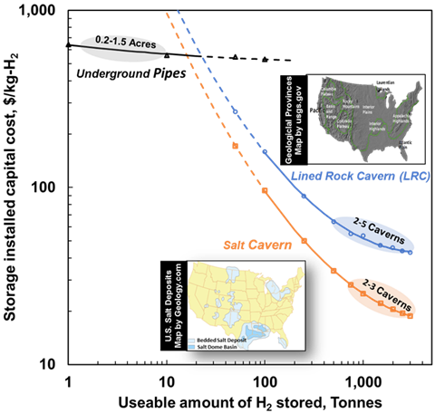
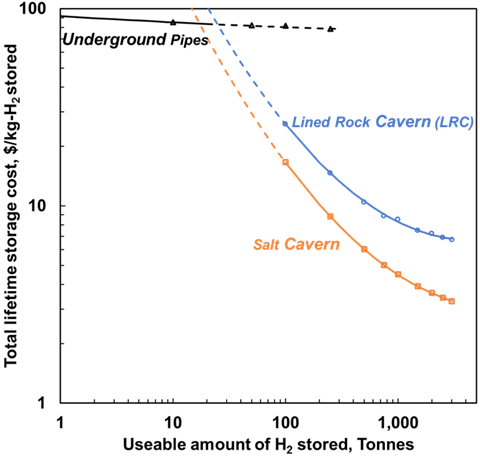
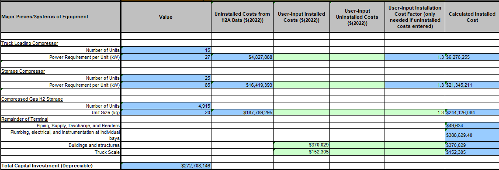
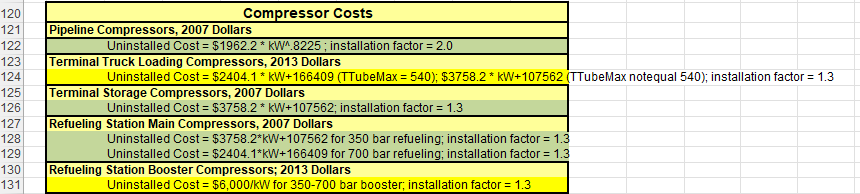
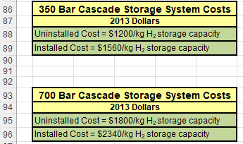
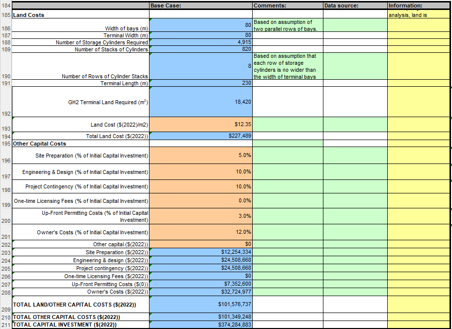
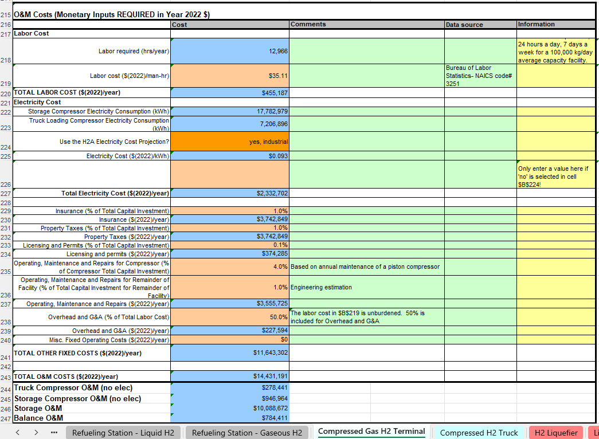
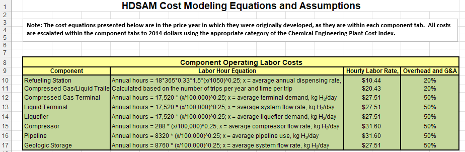

(h2-storage-cost)=
# Bulk Hydrogen Storage Cost Model

This models the cost of bulk storage of hydrogen based on the total kg capacity and kg/h charge/discharge requirements.
The model can be found at `h2integrate\storage\hydrogen\h2_storage_cost.py`.
This file contains a `HydrogenStorageBaseCostModel` which is then used to define models for different types of storage.

## Storage Types

H2Integrate models four types of bulk hydrogen storage technologies:

1. **Underground Pipe Storage (`PipeStorageCostModel`)**: Hydrogen stored in underground pipeline networks
2. **Lined Rock Caverns (LRC) (`LinedRockCavernStorageCostModel`)**: Hydrogen stored in rock caverns with engineered linings
3. **Salt Caverns (`SaltCavernStorageCostModel`)**: Hydrogen stored in solution-mined salt caverns
4. **Compressed Gas Terminals (`CompressedGasStorageCostModel`)**: Hydrogen stored in compressed gas tanks up to 700 bar

These storage options provide different cost-capacity relationships suitable for various scales of hydrogen production and distribution.

## Cost Correlations - Options 1-3

For the first three options (underground pipe, lined rock caverns, and salt caverns), cost correlations from [Papadias and Ahluwalia](https://doi.org/10.1016/j.ijhydene.2021.08.028) are used for capital cost calculation.
The bulk hydrogen storage costs are modeled as functions of storage capacity using exponential correlations:

$$Cost = \exp(a(\ln(m))^2 - b\ln(m) + c)$$

where $m$ is the useable amount of H₂ stored in tonnes.

Operational costs are calculated using the [HDSAM model](https://hdsam.es.anl.gov/index.php?content=hdsam) from Argonne National Laboratory, which is also used to model all costs for Option 4.
This method is shown further down this page in the "Cost Correlations - Options 4".

### Installed Capital Cost and Lifetime Storage Cost

The figures below show how storage costs scale with capacity for different storage technologies:

*Figure 1a: Installed capital cost (\$/kg-H₂) as a function of usable hydrogen storage capacity*

*Figure 1b: Lifetime storage cost (\$/kg-H₂-stored) as a function of usable hydrogen storage capacity*

### Capital Cost Coefficients (Figure 1a)

| Storage                        | a        | b       | c      |
|--------------------------------|----------|---------|--------|
| Underground pipe storage       | 0.004161 | 0.06036 | 6.4581 |
| Underground lined rock caverns | 0.095803 | 1.5868  | 10.332 |
| Underground salt caverns       | 0.092548 | 1.6432  | 10.161 |

### Annual Cost Coefficients (Figure 1b)

| Storage                        | a        | b       | c      |
|--------------------------------|----------|---------|--------|
| Underground pipe storage       | 0.001559 | 0.03531 | 4.5183 |
| Underground lined rock caverns | 0.092286 | 1.5565  | 8.4658 |
| Underground salt caverns       | 0.085863 | 1.5574  | 8.1606 |

## Cost Correlations - Option 4

The compressed gas terminals (CGTs) are modeled using a simplified version of the [HDSAM model](https://hdsam.es.anl.gov/index.php?content=hdsam) from Argonne National Laboratory.
HDSAM was developed as hydrogen storage *and* transport model; we have only included the costs that are relevant to *storage* for CGT.

The model uses the calculation in the HDSAM "Compressed Gas H2 Terminal" sheet.
Although HDSAM as a whole calculates the "Terminal capacity (kg/day)", and "Design terminal storage capacity (kg)" values from other sheets, our simplified CGT model instead takes these as inputs.
- "Terminal capacity (kg/day)" from HDSAM is, in our model, set by the maximum value of the `hydrogen_in` input across its entire timeseries
- "Design terminal storage capacity (kg)" from HDSAM is, in our model, set by the `storage_capacity` input

For all of the capital and operating costs, CEPCI indexes from with in HDSAM were used to adjust costs to the 2018 cost year that is used by the other models.
These indices can be found in the "Feedstock & Utility Prices" tab of HDSAM.

### Installed Capital Cost

The figure below shows an example of the main CGT capital costs as calculated by HDSAM:

Since we are not considering transport costs in our model, the "Truck Loading Compressor" and "Truck Scale" components of capital cost are ignored by this model.

The storage compressor size and kW power consumption are calculated using HDSAM's "H2 Compressor", which is implemented in `h2integrate\storage\hydrogen\h2_transport\h2_compression.py`.
Costs are then calculated using the equations shown here in the "Cost Data" tab of HDSAM:

The tank cost is calculated using HDSAM's cost figures for two discrete storage pressure levels: 350 bar and 700 bar.

The "Buildings and structures" cost is a constant in HDSAM.
The calculations of "Piping, Supply, Discharge, and Headers", and "Plumbing, electrical, and instrumentation at individual bays" are simplified relative to the HDSAM calculations, since these tend to be very minor components of the overall cost and the full calculation would be unnecessarily complex to implement in H2I.

For piping etc., HDSAM performs a detailed calculation of the total length of pipe needed for a certain terminal capacity, then multiplies this by an estimate of pipe cost per unit length.
In our simplified model, we ran HDSAM for multiple terminal capacities and calculated the average ratio of terminal capacity to pipe length.
This ratio is the `kg_d_per_pipe_m` constant of 300 kg/day per meter of pipe.

Similarly, for plumping etc., HDSAM performs a detailed calculation of the total number of storage bays needed for a certain terminal capacity, then multiplies this by an estimate of plumbing cost per bay.
In our simplified model, we ran HDSAM for multiple terminal capacities and calculated the average ratio of terminal capacity to number of bays.
This ratio is the `kg_d_per_bay` constant of 1600 kg/day per storage bay.

Besides the main capital costs above, other minor capital costs are shown below:

Besides land, these costs are all calculated as a precentage of the main capital costs, in the main cost table as ("Total Capital Investment (Depreciable)").
For land, we used a similar simplification based on capacity as those used for piping/plumbing.
In our simplified model, we ran HDSAM for multiple terminal capacities and calculated the average ratio of terminal capacity to "GH2 Terminal Land Required (m2)".
This ratio is the `kg_d_per_land_m2` constant of 4 kg/day per square meter of land.

### Operating Cost

The O&M costs of the CGT as calculated by HDSAM are shown below:

Of these costs, electricity cost is ignored, since this is a feedstock.
To consider electricity cost, a separate electricity feedstock or generator should be connected to the hydrogen storage model via the `plant_config`.
Most of the other costs are percentages of the "Total Capital Investment", except labor.
Labor is calculated on a scaled basis using the equations in the "Cost Data" tab of HDSAM:

